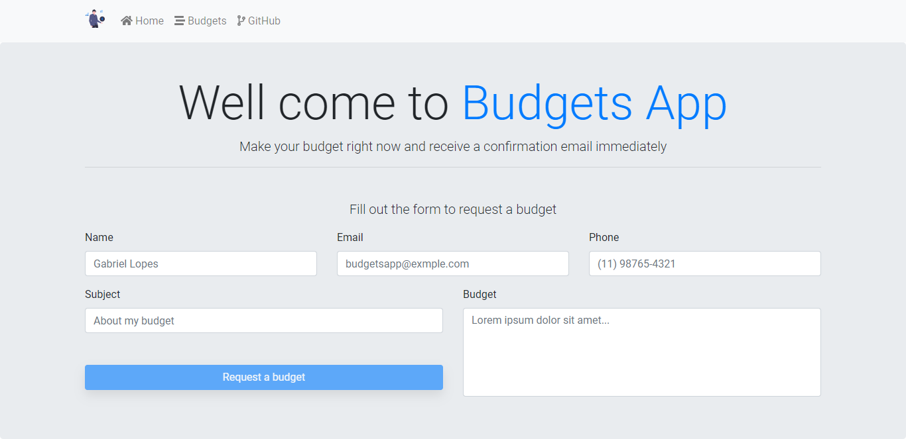

<h1>
  Budgets App
  
</h1>

###### Made with
<p>  
     
   
    
    
  
    
    
</p>

###### Project Screen



## About this App 💻
In this app, the users can send a budget request to the server through a form, in this request the user the users send their *email*, *name*, and *phone* and the *subject* and body about the budget. After the budget be received in the server, this user will receive an email with the confirmation that their budget has been sended successfully.
This app is made with React.js and Next.js in frontend, and i used [Reactstrap](https://reactstrap.github.io/) to create a responsive and reactive page.
In the server i used Node.js, Typescript and Mongodb to create the application's functionalities, and [NodeMailer](https://nodemailer.com/about/) to send the emails.
Is an simple project, but i believe that the technologies and functionalities used in this project are so powerful, and can be used in others applications and cases.

## Building 🛠
You'll need [Node.js](https://nodejs.org) and i recommend that you have installed the [Yarn](https://classic.yarnpkg.com/en/docs/install/#windows-stable) on your computer (if you are using [npm](https://www.npmjs.com/) you can run the scripts just changing *yarn* by *npm run*). After, you can run the scripts below...

###### Cloning the repository
```
git clone https://github.com/gabriellopes00/budgets-app.git && cd budgets-app
```

###### Frontend 💻
```
cd client && yarn dev
```

###### Backend ⚙
```
cd server && yarn dev
```

###### Building 🔧
```
cd client || cd server && yarn build
```

## Contact 📱
[](https://github.com/gabriellopes00)
[](https://www.linkedin.com/in/gabriel-lopes-6625631b0/)
[](https://twitter.com/_gabrielllopes_)
[](mailto:gabrielluislopes00@gmail.com)
[](https://www.facebook.com/profile.php?id=100034920821684)
[](https://www.instagram.com/_.gabriellopes/?hl=pt-br)
[](https://stackoverflow.com/users/14099025/gabriel-lopes?tab=profile)